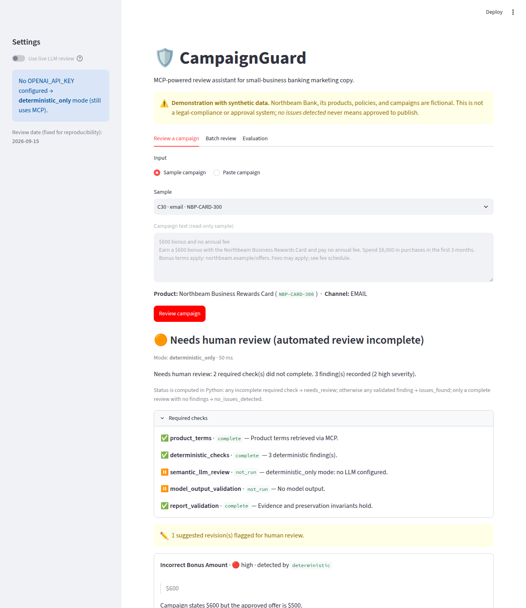

# CampaignGuard: MCP-Powered Campaign Review Assistant

[](https://github.com/madhumanju-42/campaignguard/actions/workflows/tests.yml)

> **Live agent integration status: VERIFIED (2026-09-17, `gpt-5-mini`).** Live traces show the model requesting MCP tools and recovering from an injected tool failure. See [Agent traces](#agent-traces-live-integration-evidence).

> **Demonstration with synthetic data.** Northbeam Bank and every product, policy, and campaign here are fictional. This is **not** a legal-compliance or production approval system. A `no_issues_detected` status never means a campaign is approved to publish.

CampaignGuard reviews small-business banking marketing copy (email, SMS, web) against approved product terms and internal policies. It combines deterministic checks with an LLM reviewer that calls tools through a real MCP connection. Every finding has to be backed by evidence: an exact campaign quote (or `null` when the problem is missing text), source IDs retrieved during that review, and a severity.



## Problem and scope

Marketing reviewers check claims such as bonus amounts, fee statements, offer dates, and required disclosures. Much of this work is structured, so a rule can verify it. Some of it is semantic ("your credit posts the moment you hit the goal"). This prototype shows how to:

- expose reference data and validators as MCP tools (`get_product`, `search_policy`, `check_campaign`)
- let an LLM request those tools through its tool-calling interface, with each request routed through an MCP client
- validate model output in Python (citations, quotes, invented terms) so the model can never erase a deterministic failure
- measure a deterministic baseline against hybrid review on held-out synthetic labels

Out of scope: authentication, deployment, vector databases, multi-agent setups, trend analysis, and real regulations.

## Setup

```bash
python3.11 -m venv .venv && source .venv/bin/activate
pip install -r requirements.txt
cp .env.example .env        # optional: add OPENAI_API_KEY and OPENAI_MODEL for live LLM mode
```

| Command | Purpose |
|---|---|
| `streamlit run app.py` | Launch the UI |
| `python -m pytest -q` | Run offline tests (the live smoke test skips without a key) |
| `python -m campaignguard.evaluate --split heldout` | Evaluate the baseline and hybrid modes on 20 held-out campaigns |
| `python -m campaignguard.evaluate --split dev` | Evaluate on the 10 development campaigns (the only split used for tuning) |
| `python -m campaignguard.record_traces` | Record sanitized live traces (success and failed-tool recovery). Requires a key; without one it records `unverified` and exits 2 |
| `python -m campaignguard.record_traces --mock` | Record the same scenarios with a scripted mock. These do not prove live integration |
| `python -m campaignguard.mcp_server` | Run the MCP server standalone over stdio (for example with MCP Inspector) |
| `OPENAI_API_KEY=... python -m pytest tests/test_live_smoke.py -s` | Optional live smoke test |

Secrets. Put your key only in `.env`. `.gitignore` excludes `.env` and `.env.*` but keeps `.env.example`. Before pushing to GitHub, run `./scripts/check_no_secrets.sh`, which fails if `.env` is tracked or an API-key pattern appears in tracked files. If a key has ever been pasted into chat, a commit, or a log, rotate it.

Without `OPENAI_API_KEY`, the app runs in a clearly labeled deterministic_only mode. That mode still goes through MCP, and no mock output is ever shown as a live result.

Pinned versions: `mcp==2.2.0` (the v2 `MCPServer` and `Client` APIs), `openai==3.14.1` (Responses API function calling), `streamlit==1.64.0`, `pydantic==2.13.5`, `scikit-learn==1.9.1`, `pandas==3.0.5`.

## Architecture and MCP call flow

```
Streamlit UI / evaluate.py
        │ asyncio.run(review_campaigns(...))       one connection per click or batch
        ▼
reviewer.py ──► mcp_client.py  ── mcp.Client(StdioServerParameters) ──►  mcp_server.py (subprocess)
   │               list_tools() / call_tool()   JSON-RPC over stdio        ├─ get_product     becomes data/products.json
   │               logs: tool, args, ms, ok, source IDs                     ├─ search_policy   becomes TF-IDF over data/policies.json
   │                                                                        └─ check_campaign  becomes checks.py (regex rules)
   ├─ A. orchestrator ALWAYS calls get_product + check_campaign via MCP
   ├─ B. if live: llm.py sends the discovered MCP tool schemas as OpenAI function tools
   │        loop (≤ CG_MAX_TOOL_ROUNDS): model becomes function_call becomes MCP call_tool becomes function_call_output
   │        final answer is JSON-schema-constrained, then parsed with Pydantic
   ├─ C. validation.py: reject findings with unknown or unretrieved source IDs, quotes not in the campaign,
   │        or disallowed issue types; drop revisions that introduce numeric terms absent from product data
   ├─ D. merge: deterministic findings always kept; duplicate LLM findings dropped
   ├─ E. revision_check.py: every suggested revision checked against structured product terms
   └─ F. report_validation, then status.decide_review_status(required_checks, findings) becomes ReviewReport
```

Key points:

- MCP is real. The app never imports `checks.py` or `retrieval.py` for reviews. Every lookup is a `tools/call` sent over stdio to a separate server process. `tests/test_mcp_integration.py` checks discovery and invocation over this connection.
- Schema translation. `mcp_tools_to_openai()` maps each MCP `Tool.input_schema` into a Responses API function tool. `strict` is set to `false` because MCP-generated schemas use optional fields and `$defs`. The MCP server validates arguments and returns `isError` results when they are wrong.
- Streamlit lifecycle. Each review button click runs one `asyncio.run(...)`. That call opens `async with Client(...)`, which starts the server subprocess, and closes it before the script run ends. Nothing async outlives a rerun. The tradeoff is roughly 1.6–1.8 s of server startup per click, measured locally (mostly Python and scikit-learn imports). Batch runs reuse one connection.
- Final status is decided deterministically in Python by a single function, `status.decide_review_status`. Model output (including the model's summary) never sets the status. The report records five required checks, each `complete`, `incomplete`, or `not_run`:

  | Required check | Complete when |
  |---|---|
  | `product_terms` | `get_product` via MCP returned known product terms |
  | `deterministic_checks` | `check_campaign` via MCP succeeded |
  | `semantic_llm_review` | the LLM tool loop finished with schema-valid output (`not_run` in deterministic-only mode) |
  | `model_output_validation` | every model finding passed citation, quote, and issue-type validation |
  | `report_validation` | final invariants hold: citations available, quotes present, deterministic findings preserved, every revision checked |

  Precedence is fixed:
  1. Any required check not complete becomes `needs_review`. This takes precedence over findings.
  2. Otherwise, any validated finding becomes `issues_found`.
  3. Only a complete review with no findings becomes `no_issues_detected`.

  Consequence: **deterministic-only reviews are always `needs_review`**, even when they contain findings, because semantic review did not run. The findings are still reported.
- Suggested-revision verification (`revision_check.py`). Every revision, whether from the rules or the model, is checked against structured product terms:
  - dollar amounts, classified by nearby keywords as bonus, fee, or requirement amounts; fee amounts also have their monthly or annual frequency checked
  - percentages, durations, and dates, including a date with no year
  - "no fee" or "never pay a fee" claims, with a narrow exception for "first year" that matches the card's terms
  - fee-waiver claims, and "instant" or "no waiting" bonus-timing claims
  - promoting an offer that has expired as of the review date

  Each revision is marked `verified`, `unsupported`, `unverifiable`, or `no_checkable_claims`. Unsupported and unverifiable revisions are flagged `needs_human_review`, counted in `revisions_needing_human_review`, and shown with a warning in the UI. They are flagged rather than silently deleted.

  This is **not complete semantic verification**. It does not check meaning, tone, completeness, numbers written in words, or non-numeric promises, and `verified` only means the extracted claims match the terms. Revision flags are advisory: they do not change the status precedence above.
- Untrusted input. Campaign text is placed inside `<campaign_data>` tags, and the system prompt says never to follow instructions found there. A regex flags common injection phrasing deterministically. The only tools available are the three read-only project tools, and unknown tool names are refused before any call.

### Data (`data/`, `eval/`)

| File | Contents |
|---|---|
| `data/products.json` | 3 fictional products (checking, savings, card): bonus amount, eligibility, fees, waivers, validity dates, channel-specific disclosure IDs |
| `data/policies.json` | 10 fictional policies (`POL-001`…`POL-010`) with channel applicability |
| `data/campaigns.json` | 30 synthetic campaigns: clean copy, wrong amounts, "instant" claims, "no fees" claims, missing disclosures, expired offers, unknown products, ambiguous wording, injection attempts |
| `data/sample_batch.csv` | CSV upload example |
| `eval/labels.json` | Expected `(issue_type, severity, source_ids)` per campaign, plus dev (C01–C10) and held-out (C11–C30) splits. **Loaded only by `evaluate.py`**, never at review time or by the LLM |
| `eval/generate_dataset.py` | Script that generated campaigns and labels |

The review date is fixed at `2026-09-15` (`CG_REVIEW_DATE`), so date checks are reproducible. At that date the savings offer has expired.

## Sample review (deterministic_only, campaign C30)

Input (email, `NBP-CARD-300`): *"$600 bonus and no annual fee. Earn a $600 bonus with the Northbeam Business Rewards Card and pay no annual fee. Spend $6,000 in purchases in the first 3 months. Bonus terms apply… Fees may apply…"*

```json
{
  "campaign_id": "C30", "review_date": "2026-09-15", "mode": "deterministic_only",
  "review_status": "needs_review",
  "required_checks": [
    {"name": "product_terms", "state": "complete"}, {"name": "deterministic_checks", "state": "complete"},
    {"name": "semantic_llm_review", "state": "not_run", "detail": "deterministic_only mode: no LLM configured."},
    {"name": "model_output_validation", "state": "not_run"}, {"name": "report_validation", "state": "complete"}
  ],
  "findings": [
    {"issue_type": "incorrect_bonus_amount", "severity": "high", "campaign_quote": "$600",
     "source_ids": ["NBP-CARD-300:offer", "POL-001"],
     "explanation": "Campaign states $600 but the approved offer is $500.",
     "suggested_revision": "$500 bonus and no annual fee", "detected_by": "deterministic",
     "revision_check": {"status": "unsupported", "needs_human_review": true, "claims": [
        {"kind": "bonus_amount", "text": "$500", "result": "supported"},
        {"kind": "fee_claim", "text": "no annual fee", "result": "unsupported",
         "reason": "Product has fees; a no-fee claim contradicts the terms."}]}},
    {"issue_type": "incorrect_fee_claim", "severity": "high", "campaign_quote": "no annual fee",
     "source_ids": ["NBP-CARD-300:fees", "POL-003"], "detected_by": "deterministic", "...": "..."},
    {"issue_type": "missing_disclosure", "severity": "medium", "campaign_quote": null,
     "source_ids": ["DISC-CREDIT-APPROVAL", "POL-004"], "suggested_revision": "Add: \"Subject to credit approval.\"",
     "revision_check": {"status": "no_checkable_claims", "needs_human_review": false}}
  ],
  "revisions_needing_human_review": 1,
  "summary": "Needs human review: 2 required check(s) did not complete. 3 finding(s) recorded (2 high severity)."
}
```

The rule-based fix for the amount copied the surrounding sentence, which still says "no annual fee". The revision verifier caught that, so the revision is flagged instead of being presented as a safe fix.


## Evaluation

Method. `python -m campaignguard.evaluate` runs both modes on the same split through MCP and writes `results/eval_<split>_latest.json` along with a timestamped copy. The output records the dataset version, review date, configuration, package versions, model, and run time.

- Matching rule. Findings are compared as unique `(campaign_id, issue_type)` pairs, so predictions are deduplicated before scoring.
- Failed reviews. Reviews that raise an exception count as zero predictions and appear in `failed_with_exception`. They are never dropped.
- Metrics.
  - micro precision, recall, and F1
  - per-category results
  - missed high-severity issues
  - false-positive pairs, and clean campaigns that received any finding
  - invalid citations: rejected model citations, plus final citations not found in the catalog
  - citation support rate: the share of matched findings that cite at least one expected source ID. This is a partial groundedness check, because a valid source ID does not prove the claim is supported.
  - status distribution, completion, and which required checks were not complete
  - suggested-revision verification outcomes and how many were flagged for human review
  - median and p95 latency

Measured results (held-out, n=20, single run on 2026-09-17, dataset `cg-synthetic-v1.1`, model `gpt-5-mini`, prompt `v2`, max 4 tool rounds):

| Mode | Precision | Recall | F1 | Missed high-severity | Clean campaigns with findings | Invalid citations | Failed | needs_review | Revisions flagged | Latency median / p95 |
|---|---|---|---|---|---|---|---|---|---|---|
| deterministic_only | 1.00 | 0.70 | 0.82 | 4 (C17, C18 instant bonus; C20 paraphrased fee; C27 subtle injection) | 0 / 3 | 0 | 0 / 20 | 20 / 20† | 1 of 10 (3 verified, 6 no checkable claims) | 4.5 ms / 8.0 ms* |
| hybrid (deterministic + LLM) | 0.95 | 1.00 | 0.98 | 0 | 0 / 3 | 0 | 0 / 20 | 1 / 20 (C25, unknown product) | 3 of 17 (8 verified, 2 unsupported, 1 unverifiable, 6 no checkable claims) | 15.2 s / 27.9 s* |

†By design: `semantic_llm_review` is `not_run` in deterministic-only mode, so every review is `needs_review`. One review (C25, unknown product) also has `product_terms` incomplete. Precision and recall are computed from findings, not status.

\*Small-sample local measurement per review over an already-open MCP connection. It excludes the roughly 1.7 s server startup and includes no LLM calls.

Per category, the deterministic baseline scores 0 recall on `unsupported_instant_bonus` (2 labels) and `misleading_or_ambiguous_claim` (2), 0.67 on `incorrect_fee_claim`, and 0.5 on `instruction_injection`. **Hybrid review reached 1.0 recall in every category** and caught all 4 high-severity issues the rules missed (C17, C18, C20, C27). Its one false positive was an extra `misleading_or_ambiguous_claim` on C17, so that category scored precision 0.67. Citation support on true positives was 1.0 for both modes. Hybrid wall time was 334 s for 20 reviews.

Honesty notes.

- The labels were written alongside the synthetic data by the same author. They need independent human verification and say nothing about real-world performance.
- Rules were tuned only on dev (C01–C10). Early in development the deterministic checks were printed once across all 30 campaigns before the dev-driven fix to amount classification (keywords must sit in the same sentence as the amount). That exposure was a minor leak and is disclosed here.
- Prompt and policy tuning used dev only, and the tuning history is recorded.
  1. Prompt `v1` on dev (`results/eval_dev_prompt_v1.json`) scored P 0.56 / R 1.00. The model flagged `misleading_or_ambiguous_claim` on 7 dev campaigns because it read POL-008 as requiring every ad to repeat "new customers only".
  2. A held-out run with `v1` had already started. I **stopped it before it produced any output**, so no held-out results were seen before tuning.
  3. I clarified the fictional POL-008 text (dataset becomes `cg-synthetic-v1.1`) and added prompt rule 8 (prompt `v2`). Dev then scored P 1.00 / R 1.00 (`results/eval_dev_prompt_v2.json`). A perfect score on 10 examples is likely overfit.
  4. The prompt was frozen and held-out was run once. That single run is the result reported above.
- **Single run, nondeterministic model.** Repeating the run will vary. In an earlier dev spot check, the same prompt flagged different campaigns across runs. Treat 0.98 F1 on 20 synthetic examples as a demonstration, not a performance estimate.
- \*Hybrid latency includes OpenAI API round trips (usually 1–2 model calls plus MCP tool calls per review).

## Agent traces (live integration evidence)

`python -m campaignguard.record_traces` records two sanitized traces in `results/traces/`:

1. `live_success_trace.json` (campaign C06). Criteria: the model requested at least one tool; the MCP call succeeded and appears in the MCP client log; `semantic_llm_review` is complete.
2. `live_failed_tool_recovery_trace.json` (campaign C18). The MCP server runs with test-only fault injection (`CG_FAULT_INJECT=search_policy:1`), so the model's first `search_policy` call returns a real protocol-level tool error. Criteria: the error reached the model; the agent kept going (retried, or went straight to a final answer); the final output is schema-valid; `semantic_llm_review` is complete.

Each trace records tool names, arguments, MCP success or failure, durations, returned source IDs, errors, required checks, and the status. Traces contain no API keys, request headers, or reasoning items, and long strings are truncated. `LIVE_VERIFICATION_STATUS.json` is set to `verified` only when a live run meets every criterion in both traces.

**Current state: VERIFIED** (`results/traces/LIVE_VERIFICATION_STATUS.json`, recorded 2026-09-17 with `gpt-5-mini`).

- `live_success_trace.json` (C06). The model called `search_policy` through MCP. The call succeeded and returned `POL-002`, `POL-001`, and `POL-008`, and the model's final output was schema-valid. Status: `issues_found`, with all 5 required checks complete.
- `live_failed_tool_recovery_trace.json` (C18). The model's first `search_policy` call got the injected tool error. The model retried `search_policy` on its own, the retry succeeded, and it returned schema-valid output. Status: `issues_found`, with all required checks complete.

The earlier `mock_*_trace.json` files are kept, labeled as mocks, to show what the offline tests exercise. The live smoke test (`tests/test_live_smoke.py`) also passed.

## Tests (what they actually verify)

56 tests pass with credentials: 55 offline and 1 live smoke test. Without `OPENAI_API_KEY`, the live test is skipped.

| Area | Test file |
|---|---|
| Wrong amount (with requirement amounts ignored), expired offer driven by explicit review date, wrong stated end date, valid campaign, unknown product, missing disclosures with null quotes, literal fee claim and injection, plus one test documenting a paraphrase the rules miss | `test_checks.py` |
| Rejection of unknown and unretrieved citations and unsupported quotes; merge that preserves deterministic findings; invariants that catch a lost deterministic finding or an unchecked revision | `test_validation.py` |
| Status precedence: every required check in the `incomplete` and `not_run` states, each with and without findings; a missing check entry | `test_status.py` |
| Revision verification: supported amounts, fees, waivers, dates, and first-year wording; unsupported bonus, fee frequency, no-fee, instant, date, duration, percentage, and expired-offer claims; unverifiable cases; no checkable claims; a rule-based auto-fix flagged for keeping a violation | `test_revision_check.py` |
| Trace sanitizer redacts keys, drops headers and reasoning items, and truncates long strings | `test_trace.py` |
| OpenAI Responses adapter against a mocked HTTP transport: request shape (translated MCP tools, JSON-schema output, `function_call_output` round trip) and response parsing. The live API was not called | `test_openai_adapter.py` |
| Real stdio MCP: discovery, schemas, all three tools, tool errors, schema-violation errors, call log | `test_mcp_integration.py` |
| Scripted mock LLM (clearly marked) with real MCP: grounded finding added through an LLM-requested MCP call; LLM cannot erase a deterministic failure; malformed output → `needs_review` with findings kept; provider timeout; tool-loop termination at the limit; invalid citation or quote → `needs_review`; unknown tool refused; unknown product skips LLM; required tool failure; adversarial campaign; deterministic-only reviews stay `needs_review` even with findings; precedence end to end; model summary cannot set status; LLM revision with invented terms flagged; failed-tool recovery through real MCP fault injection | `test_reviewer.py` |

Adversarial testing scope. For C08, the tests verify three things:

1. The injection text is flagged deterministically.
2. The text reaches the model only inside `<campaign_data>`.
3. A mock model that "obeys" the injection by returning no findings cannot clear the flag or change the summary.

This does not show that a real model resists prompt injection, and it does not cover all injection styles. C27 (a subtle "reviewer note") evades the regex.

## Limitations and design tradeoffs

- Text matching is shallow. It misses amounts written in words, paraphrased fees, reworded disclosures, and context. Disclosure checks test only for the presence of a pattern, not placement or prominence.
- TF-IDF retrieval over 10 short policies is transparent but lexical. Synonyms can miss, and scores are not calibrated.
- Citation validation checks existence and availability, not support. A model can cite a real, retrieved policy that does not back its claim. The citation support rate in evaluation is only a partial proxy.
- Revision verification is pattern-based and partial. It checks digits-based amounts, percentages, durations, dates, fee claims, waiver claims, and timing claims. It does not check meaning, and numbers written in words are missed. Classifying an amount as bonus, fee, or requirement uses nearby keywords and can be wrong, in which case the claim is marked `unverifiable`.
- Strict evidence rules lower completion. One bad model citation sends the whole review to `needs_review`. That is deliberate: failing safe beats silently passing.
- Deterministic-only mode is always `needs_review` under the precedence rule, because semantic review is a required check that did not run.
- Revision flags do not change status. Status answers "did the required checks complete, and were issues found?", and a flagged revision is advisory. Making flagged revisions force `needs_review` would be a one-line change: add a required check.
- Live verification is point-in-time. It covers one model (`gpt-5-mini`), two traces, and one evaluation run. Changing the model or prompt requires re-running `record_traces` and the evaluation.
- Two timeouts. Server startup (`initialize` + `tools/list`) has its own budget, `CG_MCP_CONNECT_TIMEOUT_S` (default 90 s), because the subprocess imports scikit-learn and pandas and a cold Python cache can take tens of seconds on some machines. Individual tool calls keep the short `CG_MCP_TOOL_TIMEOUT_S` (default 15 s).
- Server lifecycle. A fresh stdio server per click is simple and leak-free, but it adds about 1.7 s. A long-lived connection would need careful event-loop ownership inside Streamlit.
- Synthetic scale. 30 campaigns and one reviewer's labels are only enough to demonstrate the method.
